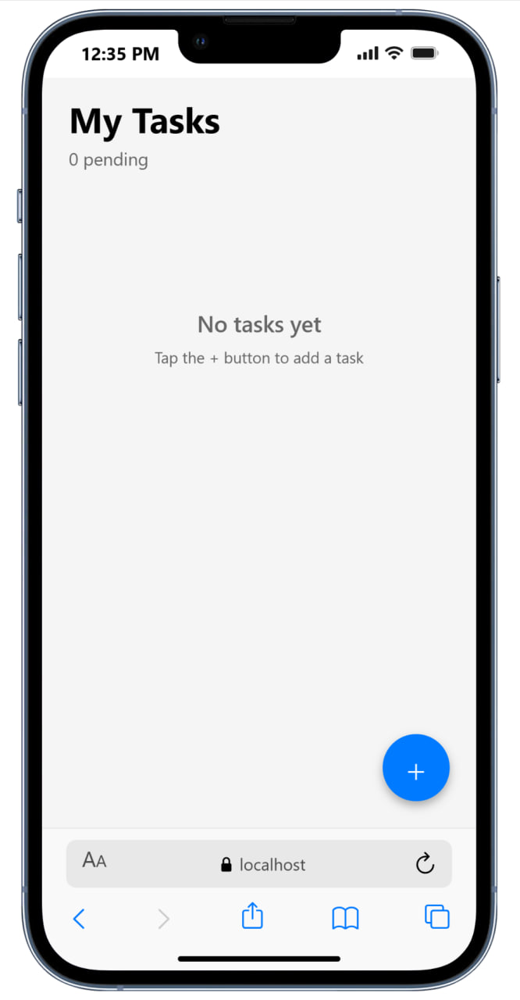
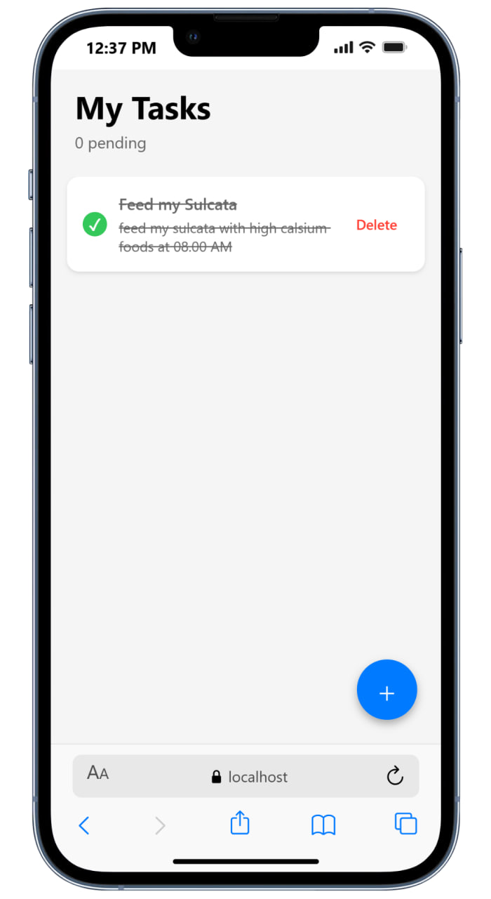
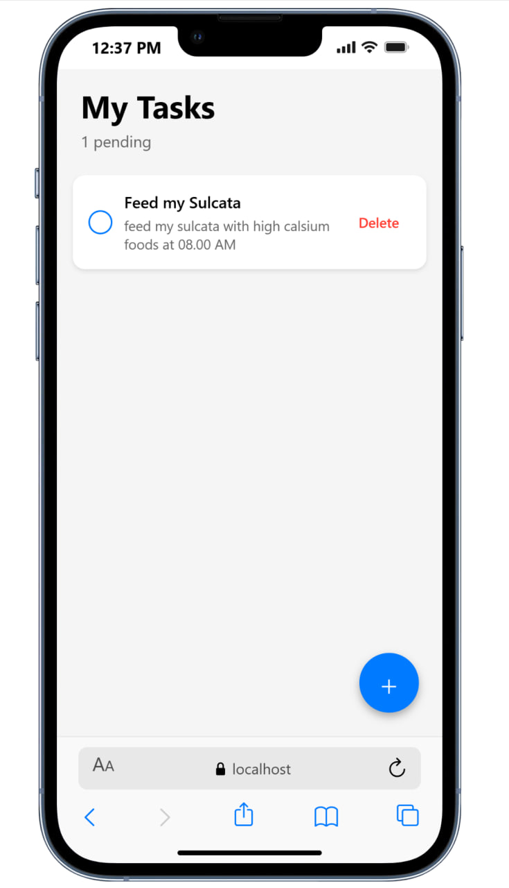

# Simple Todo List App

A clean and simple todo list application built with React Native and Expo. Used for personal school project.

## Features

- Add new tasks with title and description
- Edit existing tasks
- Delete tasks
- Mark tasks as complete/incomplete
- Data persists locally using AsyncStorage

## Tech Stack

- React Native
- Expo
- TypeScript
- AsyncStorage

## Project Structure

```
├── app/
│   └── index.tsx              # Main screen with todo list
├── components/
│   ├── TodoItem.tsx           # Single todo item component
│   └── AddTaskModal.tsx       # Modal for adding/editing tasks
├── types/
│   └── todo.ts                # TypeScript interfaces
├── utils/
│   └── storage.ts             # AsyncStorage helper functions
└── constants/
    └── Colors.ts              # App color palette
```

## How It Works

### Data Storage

All tasks are saved locally on your device using AsyncStorage. The data persists even after closing the app.

### Key Functions

- **Add Task**: Tap the blue + button to create a new task
- **Edit Task**: Tap on any task to edit it
- **Complete Task**: Tap the checkbox to mark as done
- **Delete Task**: Tap the "Delete" button to remove a task

## Screenshots

<table>
  <tr>
    <td align="center"></td>
    <td align="center"></td>
  </tr>
  <tr>
    <td align="center"></td>
    <td align="center"></td>
  </tr>
</table>